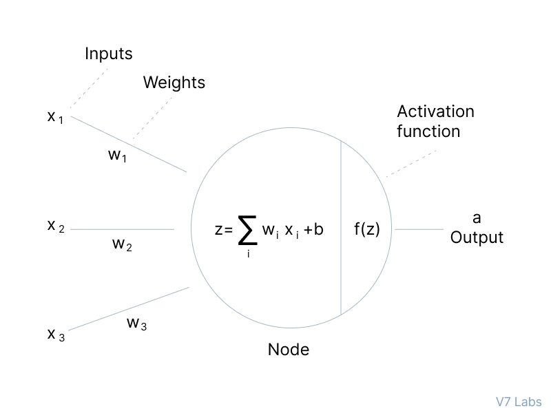
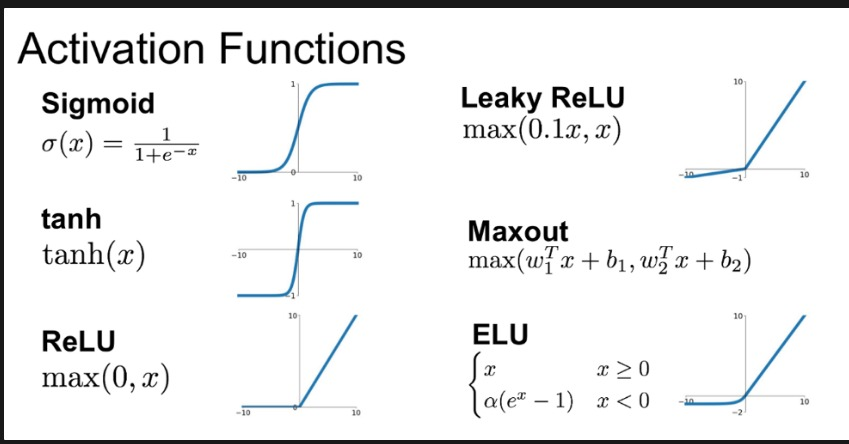
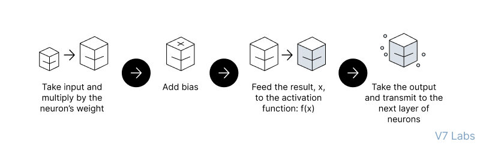

# Activation Functions (Transfer Funcitions)

Defines the output of a neuron given a set of inputs. It decides whether a neuron should be activated or not

> [!NOTE]
> All hidden layers usually use the same activation function. However, the output layer will typically use a different activation function from the hidden layers. The choice depends on the goal or type of prediction made by the model.

## Feedfoward 

## Sigmoid

## References

- **Activation Functions in a Neural Network explained** by
deeplizard
https://www.youtube.com/watch?v=m0pIlLfpXWE

 - **Activation Functions in Neural Networks [12 Types & Use Cases]**
  https://www.v7labs.com/blog/neural-networks-activation-functions

- **Activation Functions in Neural Networks** https://towardsdatascience.com/activation-functions-neural-networks-1cbd9f8d91d6

- **Monotonic function**: A function which is either entirely non-increasing or non-decreasing.